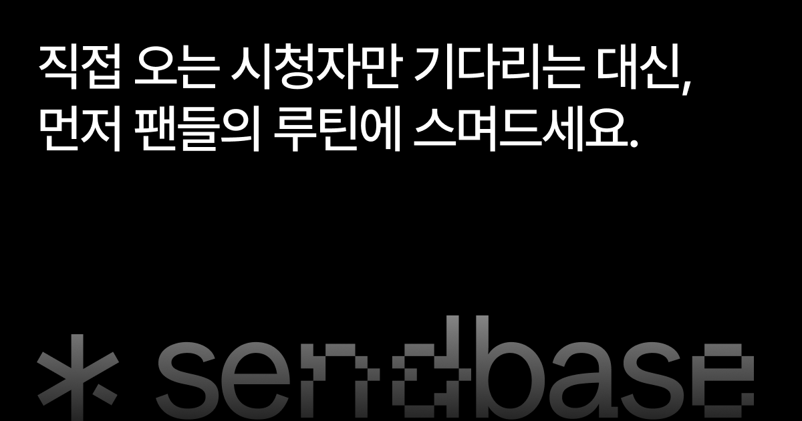

# Sendbase

한 번 작성한 방송 공지를 Threads, X, Discord, TikTok, 네이버 카페, SOOP 게시판에 함께 발행하는 오픈소스 웹 애플리케이션입니다.

[센드베이스 바로 사용하기](https://sendbase.workbase.im) · [버그 신고 및 기능 제안](https://github.com/workbase/sendbase/issues)



## 주요 기능

- 여러 플랫폼에 게시할 제목, 본문, 이미지 통합 작성
- 플랫폼별 글자 수, 이미지 수, 링크 제한 사전 확인
- Threads와 X의 연속 게시물 작성
- OAuth를 이용한 Threads, X, Discord, TikTok 계정 연결
- 치지직, SOOP 또는 씨미 계정을 이용한 로그인
- 플랫폼별 발행 결과와 게시 이력 확인
- 라이트·다크 테마와 반응형 UI

네이버 카페와 SOOP 게시판 발행에는 별도의 센드베이스 Chrome 확장 프로그램이 필요합니다. 배포 중인 확장 프로그램은 공식 센드베이스에서 설치할 수 있지만, 확장 프로그램 소스는 이 저장소에 포함되어 있지 않습니다. 따라서 포크한 서비스의 도메인에서 두 플랫폼을 지원하려면 호환되는 확장 프로그램을 별도로 준비해야 합니다.

## 기술 스택

- Next.js 16 App Router, React 19, TypeScript
- Tailwind CSS 4, shadcn/ui
- Supabase Database, Storage
- pnpm, Vitest

## 셀프 호스팅

### 준비 사항

- Node.js 20.9 이상
- pnpm
- 로컬 개발 시 Docker
- 사용할 로그인 및 게시 플랫폼의 개발자 앱

각 플랫폼은 앱 생성, 권한 승인 또는 검수를 요구할 수 있습니다. 필요한 플랫폼만 설정할 수 있지만, 서비스를 사용하려면 치지직, SOOP, 씨미 중 하나 이상의 로그인 제공자를 설정해야 합니다.

### 1. 저장소 설치

```bash
git clone https://github.com/workbase/sendbase.git
cd sendbase
pnpm install
```

### 2. Supabase와 환경 변수 설정

로컬 Supabase를 시작합니다.

```bash
pnpm supabase start
```

`pnpm supabase status`에 표시되는 API URL과 `service_role key`를 사용해 프로젝트 루트에 `.env.local`을 만듭니다. 이 파일은 Git에 커밋하지 마세요.

```dotenv
NEXT_PUBLIC_APP_URL=http://localhost:3000
NEXT_PUBLIC_SUPABASE_URL=http://127.0.0.1:54321
SUPABASE_SERVICE_ROLE_KEY=your-service-role-key
TOKEN_ENCRYPTION_KEY=replace-with-a-random-string-at-least-32-characters
```

`TOKEN_ENCRYPTION_KEY`는 연결된 계정의 토큰을 암호화합니다. 운영을 시작한 뒤 값을 변경하면 기존 토큰을 복호화할 수 없으므로 안전하게 보관하세요. `SUPABASE_SERVICE_ROLE_KEY`는 서버 전용이며 `NEXT_PUBLIC_` 접두사를 붙이거나 클라이언트 코드에 노출하면 안 됩니다.

데이터베이스 마이그레이션을 적용하고 TypeScript 타입을 생성합니다.

```bash
pnpm db:up
```

### 3. 연동할 플랫폼 설정

사용할 연동에 해당하는 값만 `.env.local`에 추가합니다.

| 용도 | 환경 변수 | 필수 여부 |
| --- | --- | --- |
| 치지직 로그인 | `CHZZK_CLIENT_ID`, `CHZZK_CLIENT_SECRET` | 치지직 로그인 사용 시 |
| SOOP 로그인 | `SOOP_CLIENT_ID`, `SOOP_CLIENT_SECRET` | SOOP 로그인 사용 시 |
| 씨미 로그인 | `CIME_CLIENT_ID`, `CIME_CLIENT_SECRET` | 씨미 로그인 사용 시 |
| Threads 발행 | `THREADS_CLIENT_ID`, `THREADS_CLIENT_SECRET` | Threads 사용 시 |
| X 발행 | `X_CLIENT_ID`, `X_CLIENT_SECRET` | X 사용 시. Public client는 secret 생략 가능 |
| Discord 발행 | `DISCORD_CLIENT_ID`, `DISCORD_CLIENT_SECRET` | Discord 사용 시 |
| TikTok 발행 | `TIKTOK_CLIENT_KEY`, `TIKTOK_CLIENT_SECRET`, `TIKTOK_MEDIA_URL_PREFIX` | TikTok 사용 시 |
| TikTok 상태 확인 | `CRON_SECRET` | 운영 환경에서 TikTok 사용 시 |
| Crisp 고객 지원 | `NEXT_PUBLIC_CRISP_WEBSITE_ID` | 선택 |

TikTok의 `TIKTOK_MEDIA_URL_PREFIX`는 TikTok 개발자 앱에서 인증한 Supabase Storage 공개 URL과 정확히 같아야 합니다.

```text
https://<project-ref>.supabase.co/storage/v1/object/public/post-media/
```

OAuth 앱에는 사용하는 기능에 맞춰 아래 콜백 URL을 등록합니다. `<APP_URL>`은 `NEXT_PUBLIC_APP_URL`과 같은 origin이며 끝에 `/`를 붙이지 않습니다.

```text
<APP_URL>/api/auth/chzzk/callback
<APP_URL>/api/auth/soop/callback
<APP_URL>/api/auth/cime/callback

<APP_URL>/api/connect/threads/callback
<APP_URL>/api/connect/x/callback
<APP_URL>/api/connect/discord/callback
<APP_URL>/api/connect/tiktok/callback
```

TikTok 웹훅을 사용하는 경우 다음 엔드포인트도 등록합니다.

```text
<APP_URL>/api/webhooks/tiktok
```

### 4. 실행

```bash
pnpm dev
```

브라우저에서 [http://localhost:3000](http://localhost:3000)을 엽니다.

## 배포

1. Supabase 프로젝트를 만들고 저장소의 마이그레이션을 적용합니다.
2. Next.js 애플리케이션을 Vercel 등 Node.js 호스팅 환경에 배포합니다.
3. 운영 환경 변수를 등록하고 `NEXT_PUBLIC_APP_URL`을 실제 HTTPS 주소로 변경합니다.
4. 각 OAuth 앱의 콜백 URL과 TikTok 웹훅 URL을 운영 주소로 등록합니다.

Vercel 배포 시 [`vercel.json`](vercel.json)의 Cron이 TikTok 발행 상태를 매분 확인합니다. `CRON_SECRET`을 설정하면 Vercel이 요청의 `Authorization` 헤더를 구성하며, 이 값이 없으면 상태 확인 엔드포인트가 요청을 거부합니다. 현재 Vercel의 분 단위 Cron은 Pro 또는 Enterprise 플랜이 필요하므로, Hobby 플랜이나 다른 호스팅 환경에서는 별도의 스케줄러로 `/api/internal/tiktok/poll`을 호출해야 합니다. 요청에는 `Authorization: Bearer <CRON_SECRET>` 헤더를 포함하세요. 자세한 제한은 [Vercel Cron 사용량 문서](https://vercel.com/docs/cron-jobs/usage-and-pricing)를 확인하세요.

이 저장소의 GitHub Actions는 `main` 브랜치의 `supabase/migrations` 변경을 원격 Supabase에 적용할 수 있습니다. 포크에서 사용하려면 GitHub의 `production` Environment에 `SUPABASE_ACCESS_TOKEN`, `SUPABASE_DB_PASSWORD`, `SUPABASE_PROJECT_ID` secret을 직접 등록하세요. 자동 배포를 사용하지 않는 경우 Supabase CLI로 마이그레이션을 적용하면 됩니다.

### 포크 후 운영 전 확인

- 랜딩 페이지, 메타데이터, 로고와 이미지에 포함된 Sendbase 및 Workbase 명칭을 운영할 서비스에 맞게 변경하세요.
- 이용약관, 개인정보처리방침, 운영자 정보와 문의처를 실제 운영 주체와 정책에 맞게 교체하세요.
- 공식 Chrome Web Store 확장 프로그램 링크는 포크한 도메인의 동작을 보장하지 않습니다. 네이버 카페와 SOOP을 지원하지 않는다면 관련 UI를 제거하거나 비활성화하세요.
- 각 플랫폼의 개발자 정책, 앱 검수 조건, API 사용 한도와 사용자 데이터 처리 의무를 직접 확인하세요.

## 개발 명령어

```bash
pnpm dev        # 개발 서버
pnpm build      # 프로덕션 빌드
pnpm start      # 프로덕션 서버
pnpm test       # 테스트
pnpm lint       # ESLint
pnpm typecheck  # TypeScript 검사
pnpm format     # Prettier 포맷
pnpm db:up      # 로컬 마이그레이션 및 DB 타입 생성
pnpm db:reset   # 로컬 데이터베이스 초기화
```

## 기여

버그 신고와 기능 제안은 [GitHub Issues](https://github.com/workbase/sendbase/issues)에 남겨 주세요. Pull Request도 환영합니다. 보안 취약점이나 인증 정보는 공개 Issue 대신 [contact@workbase.im](mailto:contact@workbase.im)로 보내 주세요.

## 라이선스

이 프로젝트는 [MIT License](LICENSE)로 배포됩니다.
